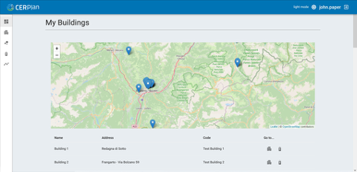
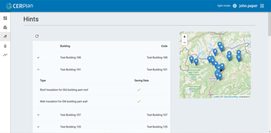
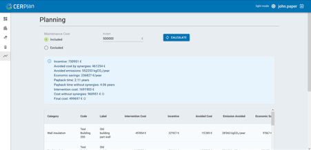

# CERPlan – Cost-Effective Renovation Plan

## Abstract

CERPlan is a web tool that helps public and private owners plan energy renovations across many buildings at once. It brings together audit data, Energy Performance Certificates (EPCs), energy bills, and reference cost and incentive data.

> [!NOTE]
> **Key feature:** CERPlan accounts for maintenance you would pay anyway. By using these "avoided costs," it often shortens payback time and makes envelope measures (insulation, windows) more attractive—not only HVAC system replacements.

## Introduction

Improving one building at a time is slow. CERPlan lets you see your whole portfolio, compare options, and choose what to do first within a fixed budget. It shows expected costs, savings, and CO₂ reductions, and builds clear, budget-based renovation packages that are easy to explain to managers and stakeholders.

## User Guide

### Portfolio

Overview of all buildings: basic info and map location.

<figure markdown="span">
  { width="800" }
  <figcaption>Portfolio overview</figcaption>
</figure>

### Audit

Organize technical data per building (surfaces, U-values, systems, lighting/ventilation, consumption).

### Hints (Automatic feasibility)

CERPlan automatically scans the audit data and runs quick simulations with preset parameters to spot promising energy-saving actions—for example, roof/wall/glazing insulation or boiler/chiller replacement—and shows interventions with low payback time. Rather than ranking every possible option, the view filters to the interesting ones only.

<figure markdown="span">
  { width="800" }
  <figcaption>Interventions highlighted by Hint phase</figcaption>
</figure>

### Energy Saving (Real offers)

Replace default costs with supplier quotes to reflect site conditions. Results update so decisions are based on realistic prices and performance.

### Planning

Set a budget and let CERPlan build the best package (starting from the fastest payback, including maintenance synergies). Compare scenarios (e.g., traditional vs. with maintenance synergies) and export a clear summary: annual savings, energy and CO₂ reductions, incentives, net investment, payback.

<figure markdown="span">
  { width="800" }
  <figcaption>Creation of the renovation package</figcaption>
</figure>

### Reports & Export

Download tables and charts for internal notes, tender prep, and multi-year plans. All assumptions are traceable.

## Why CERPlan

- **Objective priorities:** clear criteria (payback, €/kWh, CO₂) and comparable scenarios
- **Maintenance synergies:** counts "money you would spend anyway", lowering net costs and unlocking envelope actions
- **Portfolio focus:** maximize impact by choosing which buildings and which measures first
- **Transparent and flexible:** prices are editable; works with existing EPCs and audits

## Stakeholders

- Energy managers and asset owners
- Public administrations and facility teams
- Maintenance and operations staff
- Energy consultants and designers
- Researchers and policy makers

## Reference

Castagna, M., Somova, O., Pozza, C., De Michele, G., Garzia, F., Antonucci, D., Pernetti, R. (2024). *Optimizing Energy Renovation in Building Portfolios: Approach and Decision-Making Platform.* Energies, 17, 5537. (Open access)