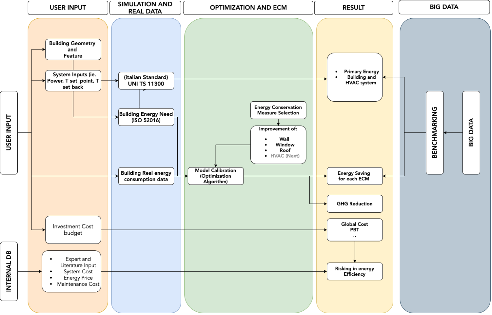
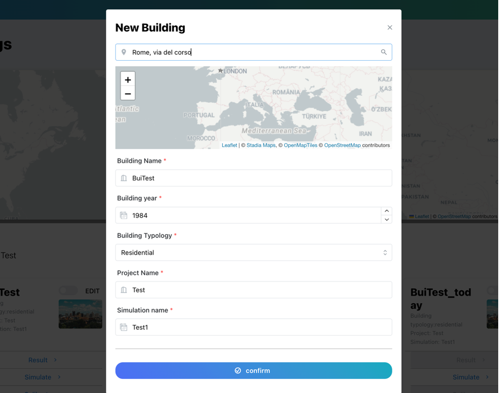
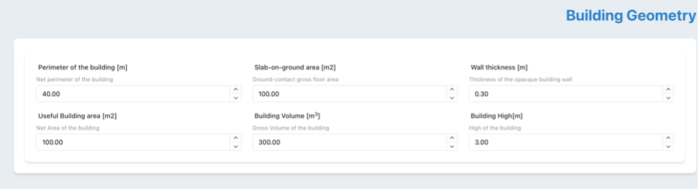
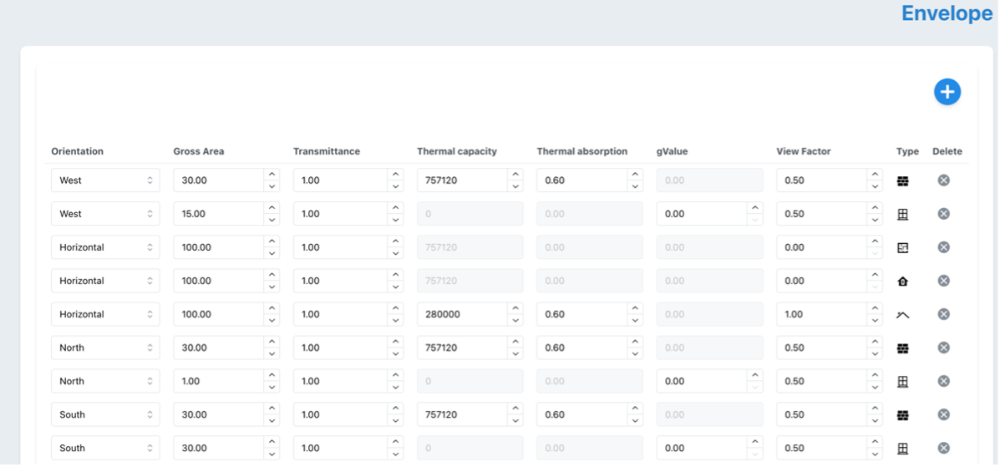
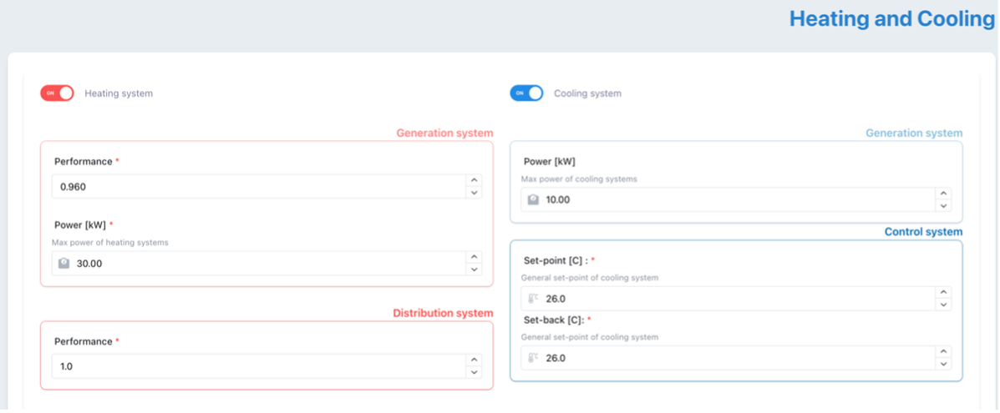
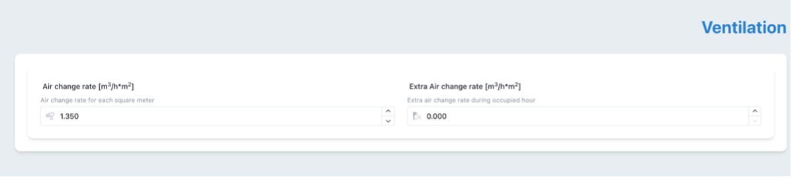
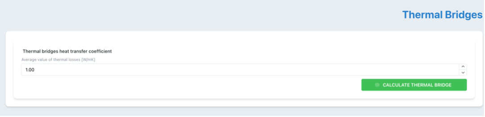
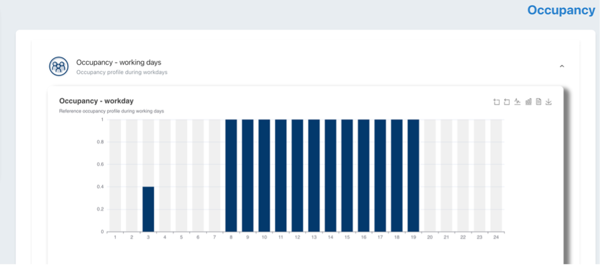

# ENCOME - ENergy COnservation MEasure tool

!!! abstract "Abstract"

    The Energy Conservation Tool is a comprehensive assessment platform that evaluates building energy performance improvements through Energy Conservation Measures (ECMs) using advanced EN ISO 52016/52010 standards. Built on the open-source pyBuildingEnergy library developed with HE BuildOn and H2020 Infinite projects, it provides semi-dynamic energy calculations with hourly resolution, surpassing traditional static methods used in energy certificates. The tool enables assessment of both building envelope measures (insulation, windows) and system improvements (HVAC, photovoltaics) through integration with the 2050 Materials database of market-available components. By transitioning from static to dynamic hourly calculations, it delivers unprecedented accuracy for evidence-based energy renovation planning. This comprehensive approach supports building professionals in making informed decisions for sustainable building transformations and strategic renovation investments

## Introduction

ENCOME aims to assess improvements in the building's energy performance when energy improvement measures are implemented. 
The tool starts with an evaluation of the building’s baseline through an energy simulation based on EN ISO 52016 and 52010 standards. 
These standards, referenced for energy performance assessment in the revised EPBD, represent an improvement compared to the calculations applied in energy certificates. In fact, it shifts from a static calculation to a semi-dynamic calculation, where energy performance is evaluated not only on an annual and monthly basis but also on a daily and hourly basis. In this context, in collaboration with the HE BuildOn and H2020 Infinite projects, the first open-source software library (pyBuildingEnergy) available to the community has been developed, enabling the calculation of the building’s energy demand for heating and cooling using EN ISO 52016 and 52010. Additionally, the calculation of domestic hot water has been added to provide a more detailed and comprehensive assessment, up to on hourly basis. This library serves as the calculation engine for the tool, through which various assessments are carried out, both initial (baseline) and virtually applying new ECMs (Energy Conservation Measures)to the building allowing for better planning of real ECM developments for that building. The applicable ECMs pertain not only to the building envelope but also to the building systems. For the envelope, it is possible to assess new opaque components by defining layers that characterize walls, floors, and roofs, while for the transparent part, new window components can be defined. For the systems, it is possible to define windows with improved performance. To achieve this, a database based on market-available construction materials, components and systems can be accessed by collaboration with the company 2050 Materials, or entered directly by the user. The ECMs that can be implemented also target the deployment of renewable energy sources. In fact, in a dedicated section, it is possible to simulate the performance of the building if a photovoltaic system were to be installed. To do this, it is assumed that the building’s thermal load is generated by an electric generator or heat pump, with the energy demand partially met by the photovoltaic system.

The tool is based on the  following schema:

<figure markdown="span">
  { width="800" }
  <figcaption>General schema of the ECM tool, including modular components localized for Italy, and interoperability with other MODERATE tools and models</figcaption>
</figure>

## User Guide

To simulate the tool some inputs are required (similar to the ones required for the EPC certification):

- **Building location**:
    Weather information, such as external temperature and solar radiation, useful for simulating the building, is directly taken from the **PVGIS**, using the dedicated API and providing the latitude and longitude of the building as input. In the tool, this information can be provided either by directly selecting the building on the map or by typing the building's address in the dedicated space 
    
    <figure markdown="span">
    { width="800" }
    <figcaption>Geolocation of the building</figcaption>
    </figure>
- **Building information**:
    where the information provided during the building creation phase is displayed, such as building name, year of construction, type, project name, and simulation number 
    
    <figure markdown="span">
    { width="800" }
    <figcaption>Geolocation of the building</figcaption>
    </figure>

- **Building geometry**:
    in this field, the geometric information of the building is provided, such as perimeter, area, volume, etc
    
    <figure markdown="span">
    { width="800" }
    <figcaption>Building geometry</figcaption>
    </figure>

- **Building envelope**:
    here the user is asked to enter information related to the envelope, both for the opaque and transparent components
    
    <figure markdown="span">
    { width="800" }
    <figcaption>List of facade elements (opaque and transparent)</figcaption>
    </figure>

    <figure markdown="span">
    { width="800" }
    <figcaption>Inputs to create a facade element</figcaption>
    </figure>

- **Building systems**:
    represent simplified information about the heating and cooling system. The user can provide either the efficiency of the different subsystems for the heating system or specify certain components such as radiators, radiant panels, or others for the emission system
    
    <figure markdown="span">
    { width="800" }
    <figcaption>Heating and Cooling systems inputs</figcaption>
    </figure>
    
- **Ventilation**:
    hourly air changes are required, as well as any extra air changes during the building's occupancy periods 

    <figure markdown="span">
    { width="800" }
    <figcaption>Ventilation</figcaption>
    </figure>

- **Internal Gains**:
    these are internal gains that can vary in case of building occupancy, in which case a specific value must be provided 

    <figure markdown="span">
    { width="800" }
    <figcaption>Internal Gains</figcaption>
    </figure>

- **Thermal bridges**:
    value of the heat transmission coefficient due to thermal bridge

    <figure markdown="span">
    { width="800" }
    <figcaption>Thermal Bridges input</figcaption>
    </figure>
   
- **Occupancy**:
    average occupancy profile of the building over 24 hours for weekdays and weekends

    <figure markdown="span">
    { width="800" }
    <figcaption>Occupancy input</figcaption>
    </figure>
    

