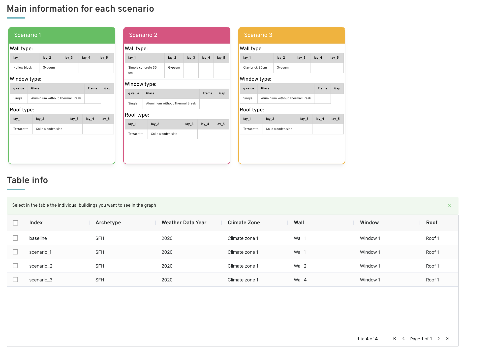

# European Building stock - IWG5 Project

!!! abstract "Abstract"

    Building renovation optimization is complex and time-consuming, with solutions often non-generalizable across different buildings, necessitating the development of an accessible decision-making tool and comprehensive database for performance assessment. This online platform leverages a simulation-driven database containing energy baselines, renovation packages, costs, and environmental impacts for European residential and office building typologies, developed through extensive parametric building performance simulations across diverse architectural characteristics and climate conditions. The tool facilitates testing and comparison of different combinations of building components, materials, and energy systems across European climate zones, providing standardized performance assessments for evidence-based renovation decisions

## Introduction 

The IWG5 database aims to evaluate various renovation packages to optimize energy performance and environmental impact, facilitating decision-making in building renovations. This is crucial for meeting the EU’s environmental targets, including a 55% net emissions reduction by 2030 and climate neutrality by 2050. The project integrates dynamic building performance simulation (BPS) with environmental life cycle assessment (LCA) and economic life cycle cost (LCC) to evaluate renovation strategies across different scenarios. It considers factors such as building archetype, climate zone, occupant behavior, economic conditions, and building orientation. This unified framework provides a holistic evaluation of energy performance, economic feasibility, and environmental impact, addressing climate variability and future climate change scenarios to ensure renovation strategy resilience.Extensive simulations covering over 900,000 cases increase the granularity and applicability of the findings, making the tool valuable for professionals and policymakers

## Methodology

The process of creating the retrofit options database begins with gathering data on the current building stock in Europe from country statistics and existing literature. This data was structured by identifying reference building typologies and their geometries to develop reference models. A parametric approach was applied to building components, including envelope properties (external walls, windows, and roof), HVAC systems, infiltration rates, and shading system control. The building envelope was parameterized, integrating a range of heat transfer coefficients (U-values) at specific intervals, along with different HVAC system types and efficiencies applied to the reference buildings. Next, a parametric analysis combined different conditions and technologies for both existing buildings and renovation solutions. The results from these simulations were elaborated, and performance indicators were calculated. Finally, the acquired results were organized into a comprehensive database. This methodology was consistently applied to all specified archetypes

<figure markdown="span">
  { width="800" }
  <figcaption>Workflow of simulation method</figcaption>
</figure>

## User Guide

On the Home page, you can either jump right into the database querying and comparison tool by clicking on the left image or explore the documentation about the calculation methodology by clicking on the right image. 

<figure markdown="span">
  { width="800" }
  <figcaption>Querying the database or using the comparison tool</figcaption>
</figure>

### Querying the database or using the comparison tool 

The left panel lets you choose between querying (filtering) the database or using the compare tool. 

<figure markdown="span">
  { width="800" }
  <figcaption>Type of analysis </figcaption>
</figure>

**Clicking on FILTER: querying the database**

TIP: feel free to use the information icons  throughout the form for further help. 

First, choose whether to get energy data or LCC (Life-Cycle Cost) data by clicking on ENERGY or LCC, respectively. 
<figure markdown="span">
  { width="800" }
  <figcaption>Input for filter analysis</figcaption>
</figure>

Second, choose the desired building type: office, single family house, or multi-family house. 

Third, select the filtering mode: you can filter by building features (wall type, window type, etc.) or building performance (target ranges for heating, cooling, and domestic hot water energy demand). 

Fourth, depending on the filtering mode you’ve selected in the third step, specify the building features or building performance ranges you’d like to filter for. Multiple choices are allowed. 

Finally, click the RUN button. You should soon see a dashboard with the results of your query. 

<figure markdown="span">
  { width="800" }
  <figcaption>Filtering results</figcaption>
</figure>

Feel free to click on “Office” or “Single and multi family house” to get more information about these building typologies. If you navigate to another page and you want to get back to the dashboard with the results, simply click on the back button of your browser. 

Below, you can use the dropdown menu to select the key performance indicator you’re most interested in. 

Under the graph, you can find the filtered data in table format. You can download the data by clicking on the DOWNLOAD button. 

<figure markdown="span">
  { width="800" }
  <figcaption>Filtering table outputs</figcaption>
</figure>

**Clicking on COMPARE: comparing different scenarios**

It is possible to either compare results within a fixed building typology or across building typologies by clicking on the left or on the right image, respectively. 

<figure markdown="span">
  { width="800" }
  <figcaption>Compare building scenarios</figcaption>
</figure>

Once you’ve made your selection, click on “Next step”. 

*Single Building typology*

First, choose the building type. 

<figure markdown="span">
  { width="800" }
  <figcaption>Single Building typology </figcaption>
</figure>

<figure markdown="span">
  { width="800" }
  <figcaption>Single Building typology components </figcaption>
</figure>

Second choose the baseline. For renovation planning, this would typically be the as-is state of the building before the renovation. 

Third, checkmark how many scenarios you’d like to consider. 

Fourth, specify the building feature changes of each scenario with respect to the baseline. 

When you are finished, click on the “Compare” button. 

A dashboard with the results of your comparison appears. 

<figure markdown="span">
  { width="800" }
  <figcaption>Comparison results </figcaption>
</figure>

Feel free to click on “Office” or “Single and multi family house” to get more information about these building typologies. If you navigate to another page and you want to get back to the dashboard with the results, simply click on the back button of your browser. 

Below, you can use the dropdown menu to select the key performance indicator you’re most interested in. 

Under the graph, you can find more information on each scenario. By hovering over one of the scenario cards, it flips and shows the set building feature performances. 

Finally, under the cards, you can find the results for the baseline and the different scenarios in table format. You can download the data by clicking on the DOWNLOAD button. 

<figure markdown="span">
  { width="800" }
  <figcaption>Comparison results </figcaption>
</figure>

*Multiple Building typology*

it is possible to compare buildings by filtering for envelope and façade types

<figure markdown="span">
  { width="800" }
  <figcaption>Multiple Building typology results </figcaption>
</figure>

<figure markdown="span">
  { width="800" }
  <figcaption>Multiple Building typology result </figcaption>
</figure>

### Detailed information on the calculation methodology

selecting the "Detailed information on the calculation methodology" option, you can find a more detailed explanation of the calculation methodology, building typology, etc.

<figure markdown="span">
  { width="800" }
  <figcaption>Detailed information on the calculation methodology </figcaption>
</figure>

